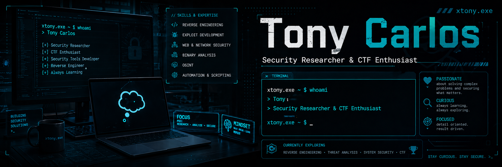

<p align="center">
  
  
  
</p>

# xtony.exe </>

**🔐 Creating security tools by day, breaking them in CTFs by night.**  
*Founder, Thinking Community*  💭

---
## 👨‍💻 About Me

```python
class Tony:
    def __init__(self):
        self.name = "xTony"
        self.role = "Security Researcher & CTF Player"
        self.organizations = "Thinking Community Founder"
        self.skills = [
            "Reverse Engineering",
            "Vulnerability Research",
            "Malware Analysis",
            "Anti-Cheat Development",
            "Tool Development",
            "Exploit Development"
        ]
    
    def current_focus(self):
        return "Advanced memory corruption research, exploit development & security tooling"
   
    def tools_developed(self):
        return [
            "Custom security tools",
            "Analysis frameworks",
            "Proof-of-concept exploits"
        ]
    
    def contact(self):
        return {
            "Discord": "xtony.exe",
            "GitHub": "https://github.com/xtony-exe"
        }

me = Tony()
````

---
## 🛠️ Languages & Tools

                      

---
## 📊 GitHub Stats:

<br/>
<div align="center">
  
</div>
<br/>
<div align="center">
  
</div>

<br/>

<picture>
  <source media="(prefers-color-scheme: dark)" srcset="https://raw.githubusercontent.com/abozanona/abozanona/output/pacman-contribution-graph-dark.svg">
  <source media="(prefers-color-scheme: light)" srcset="https://raw.githubusercontent.com/abozanona/abozanona/output/pacman-contribution-graph.svg">
  
</picture>
